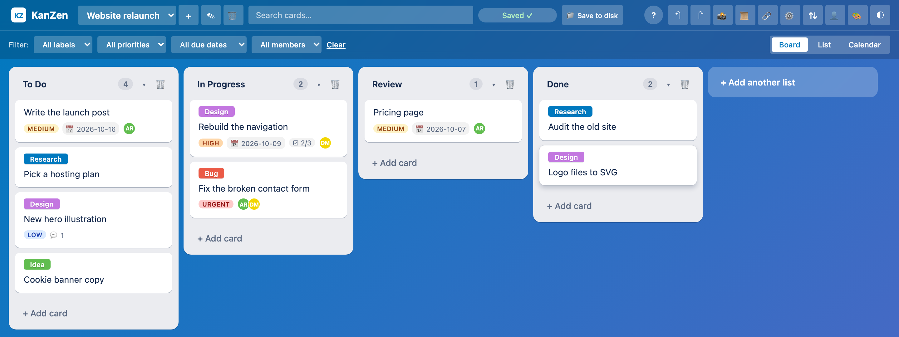

<h1 align="center">KanZen</h1>

<p align="center">
  <strong>Kanban boards as plain JSON files in a folder you choose —<br>
  with every command also callable by an agent, and nothing applied without your approval.</strong>
</p>

<p align="center">
  One HTML file. Any modern browser, desktop or phone. No account, no server, no telemetry.
</p>

<p align="center">
  <a href="LICENSE"></a>
  
  
  
</p>



## Install

| | |
|---|---|
| **Use it** | Open **[kanzen.naklitechie.com](https://kanzen.naklitechie.com/)**. In Chrome or Edge, the install button in the header adds it as an app. |
| **Self-host** | Download `index.html` and serve it: `python3 -m http.server 8000`, then <http://localhost:8000/>. |
| **Offline** | Open `index.html` from disk. Boards save to the browser; folders need `https` or `localhost`. |
| **NakliOS** | KanZen ships inside [NakliOS](https://naklios.dev) and can store boards in its Folder or encrypted Crate. |

It opens on a starter board. Click **📁 Save to disk** and pick a folder: every board becomes a
`.kanzen.json` file there, and edits save within five seconds. Without a folder, boards stay in
this browser and export as JSON at any time.

No sign-up, no config file. Every screen and shortcut is in the **?** help inside the app.

## Why

Your boards live in someone else's database. You cannot grep them, diff them, back them up with
the rest of your files, or keep using them when the service changes its plan.

KanZen keeps each board as one readable, sorted-key JSON file in a folder you own. Put the folder
in Dropbox, iCloud, Syncthing or git and you have multi-device boards without a server. It still
has what you expect from a kanban tool: labels, members, due dates, checklists, attachments,
comments, list and calendar views, undo, snapshots and an activity feed.

## Work on a board with other people

Put the board folder in git and turn on **team mode** in Board settings. The board splits into
`_board.json`, one file per card, and an append-only `_activity.jsonl`, so two people editing
different cards never produce a merge conflict. KanZen notices changes on disk within five
seconds and reloads them; when both sides changed, it asks before overwriting.

To sync without git, deploy the optional [sync Worker](worker/README.md) to your own Cloudflare
account. Boards are encrypted in the browser with a passphrase the Worker never sees. To hand
someone a copy, **🔗 Share** puts the whole board in a link, optionally encrypted. The board
travels in the `#fragment`, which browsers never send to a server.

## Let an agent work the board

Everything you can do in KanZen is also a tool: 60 of them, the same commands the UI runs. An
assistant in the browser reaches them through WebMCP; a script in the tab uses `window.kanzen`.
Agents can read every board and change the view. Any change to your data arrives as a proposal
under **🤖** in the header, and applies only when you approve it. Destructive proposals take a
safety snapshot first. The activity feed marks each agent change with the door it came through.

Choosing where boards live, sync credentials, your name and approving proposals stay with you.

## Commands

```
N                    new card in the first column
E  or  Enter         edit the focused card
/                    search titles and descriptions
← → ↑ ↓              move between cards
Cmd/Ctrl+Z           undo (50 steps per board)
Cmd/Ctrl+Shift+Z     redo
Esc                  close a dialog or menu
long-press a card    "Move to" on touch screens
```

Agents: `window.kanzen.manifest()` lists every tool with its JSON-schema input;
`window.kanzen.tools.create_card({column_id, title})` returns a proposal id, and `get_proposal`
reports what happened.

## Verify it yourself

```
cd scripts && npm ci && npx playwright install --only-shell chromium && cd ..
node scripts/lint-agent-face.mjs        # every change goes through a declared command
node scripts/test-lint-agent-face.mjs   # the lint catches six planted faults
node scripts/test-agent-face.mjs        # 16 checks: every door, approval, undo, reload
node scripts/test-responsive.mjs        # 10 checks at 1280, 1024, 800 and 375 px
node scripts/test-naklios-storage.mjs && node scripts/test-team-merge.mjs && node scripts/test-card-review.mjs
```

The lint fails when a button changes data without a command, or when a command is missing from
the manifest. CI runs all of the above on every push. The WebMCP door is tested against a
stand-in built from the 2026-09-30 draft spec; no shipping browser exposes it yet.

## License

MIT — see [LICENSE](LICENSE). Palettes come from [Rangrez](https://github.com/NakliTechie/rangrez).

Everything that shipped: [FEATURES.md](FEATURES.md) · sync Worker: [worker/README.md](worker/README.md) ·
part of the [NakliTechie](https://naklitechie.github.io/) browser-native tools series
